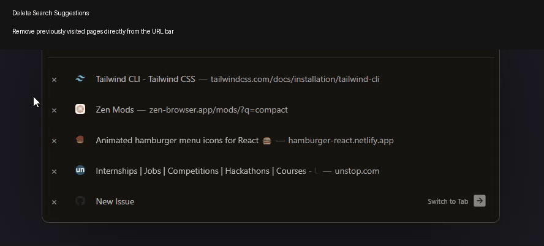

# Urlbar History/Suggestions Delete Button

Adds a small × button to URL bar suggestions/history entries.

## Features
- Delete URL bar history entries with a single click
- Native Zen Browser integration
- Doesn't interfere with Switch-to-Tab entries
- Doesn't interfere with smart suggestions/heuristic results while searching.

## Complete Installation Guide

Because this mod interacts directly with the browser's internal database, Zen's native CSS theme loader cannot run it. You must install a JavaScript engine first. 

Follow these steps exactly in order.

### Phase 1: Install the JavaScript Engine
*(If you already have `fx-autoconfig` installed from other mods, you can skip to Phase 2).*

1. Go to the [fx-autoconfig GitHub repository](https://github.com/MrOtherGuy/fx-autoconfig).
2. Click the green **Code** button and select **Download ZIP**. Extract the folder when it downloads.
3. **Install the Program Files:**
   * Open the extracted folder and go into the `program` folder.
   * Copy the `config.js` file and the `defaults` folder.
   * Paste them directly into your **Zen Installation Directory** (This is where your `zen.exe` file is located, usually in `C:\Program Files\Zen Browser`).
4. **Install the Profile Files:**
   * Go back to the extracted folder and navigate to `profile` -> `chrome`.
   * Copy the `utils` folder.
   * Open Zen Browser, type `about:support` into the address bar, and hit Enter.
   * Scroll down to the **Profile Folder** row and click **Open Folder**.
   * Inside your profile folder, open the `chrome` folder.
   * Paste the `utils` folder here.

### Phase 2: Install the Mod
Now that the engine is running, we can install the actual delete button script.

1. Download the `urlbar-delete-button.uc.js` file from this repository.
2. Go back to your Zen Profile's `chrome` folder (from Phase 1, Step 4).
3. Create a new folder named `JS` right next to the `utils` folder.
4. Move the downloaded `urlbar-delete-button.uc.js` file into the new `JS` folder.
5. Go back to Zen Browser, type `about:support` in the address bar.
6. Either close and restart the browser OR click the **Clear startup cache...** button at the top right. Zen will restart, and your mod will be active!

---

## Usage

1. Open the URL bar
2. Hover over a history entry
3. Click the **×** button to permanently remove it from browsing history
